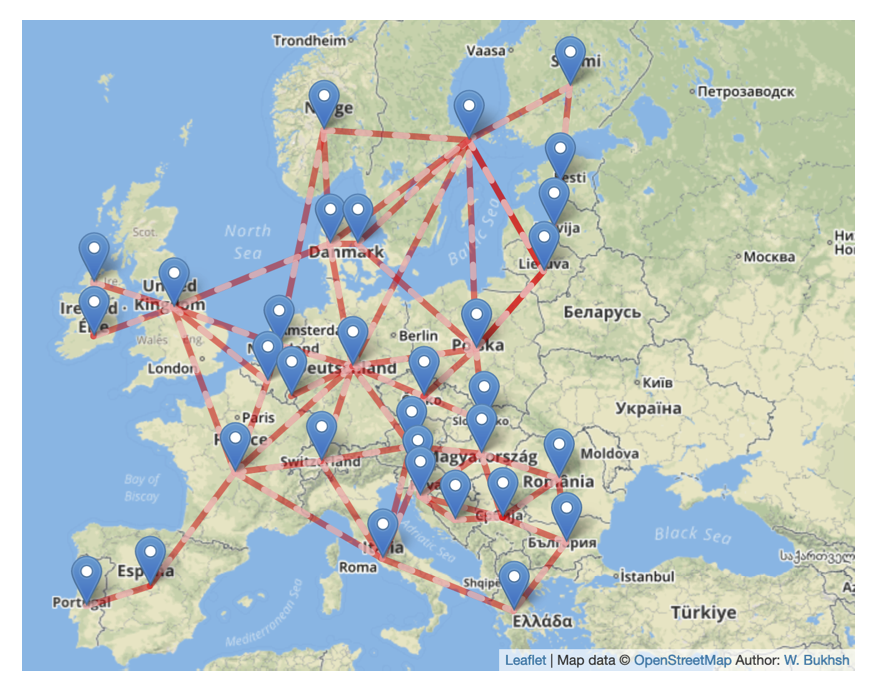
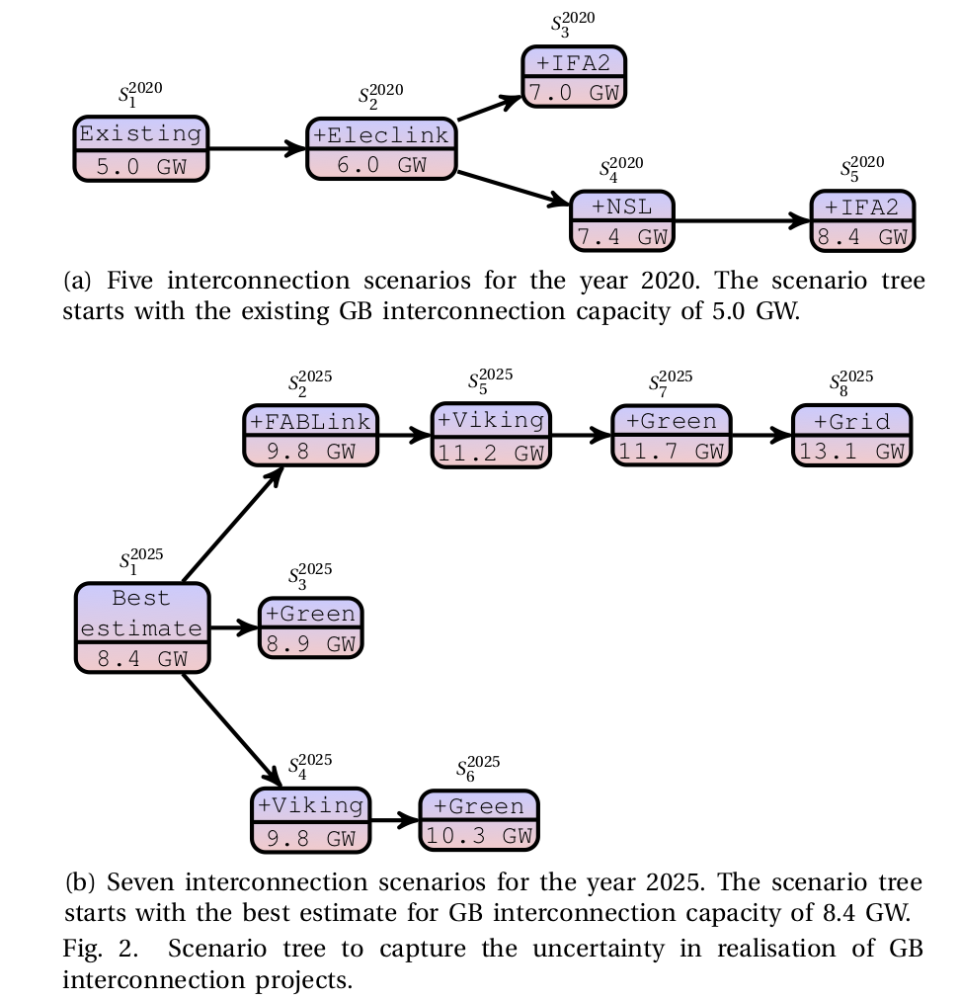
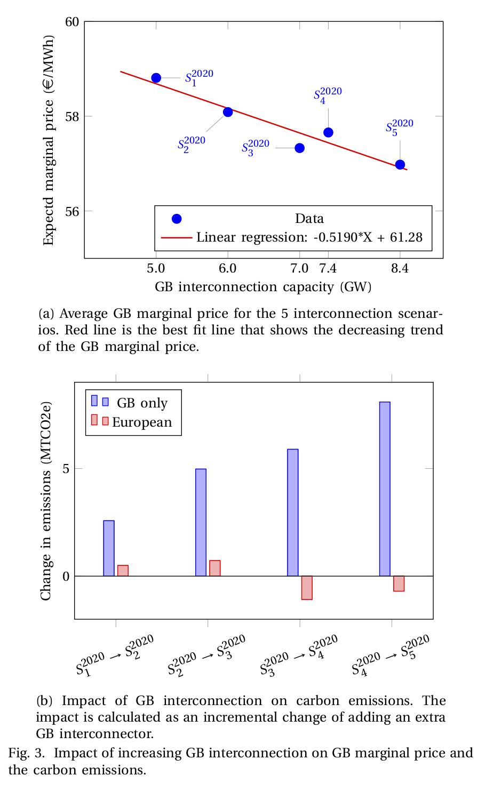
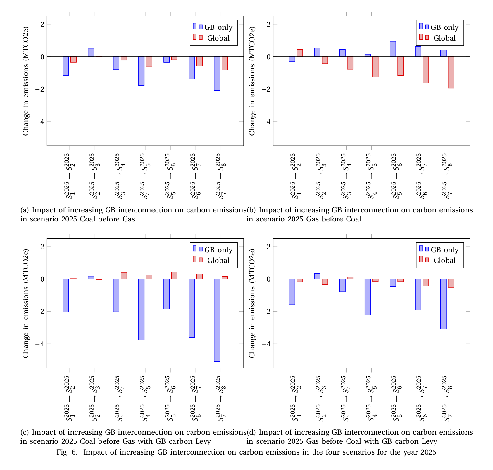

# Assessing the value of increasing GB interconnection
This GitHub repository contains supplementary material for the PSCC2020 paper: Assessing the value of increasing GB interconnection.

All the data used for graphs in the paper and supplementary material is provided in the data folder as csv files.

